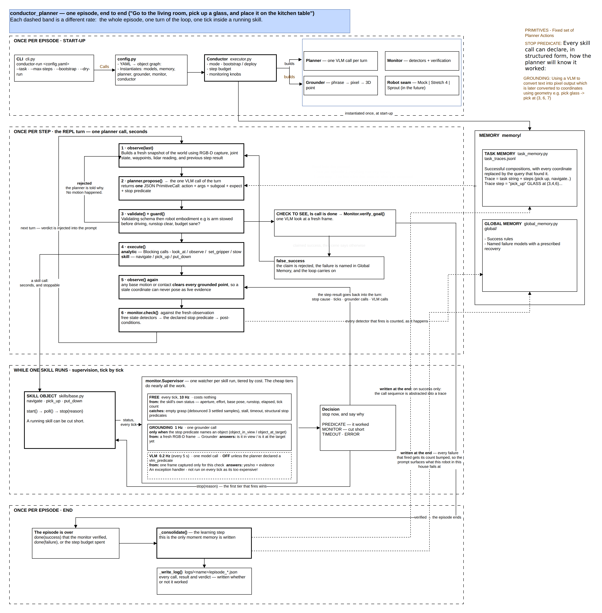

# conductor-planner

A VLM planner for long-horizon household tasks, using some ideas described in
[Harness VLA](https://harnessvla.github.io/) architecture, targeting a Hello
Robot Stretch 4 with a prebuilt SLAM map.

Reference task:

> Go to the living room, pick up a glass, and place it on the kitchen table.

```bash
python3 scripts/run_mock.py --fresh      # full task, no robot, no models, no key
python3 tests/run_without_pytest.py      # 35 tests, no dependencies
```

**No GPU required.** The planner, grounder and monitor are all hosted API calls.
This project runs on one RTX 5070 Ti (16 GB), which is not enough for the
models the literature assumes, so the models live behind an API and the card
stays free. See `docs/STRETCH_SETUP.md`, "Models and the GPU".

---

## The idea in one paragraph

The skills that touch the world — `navigate`, `pick_up`, `put_down` — are local
specialists. Each sees the current camera frame, has no map, no memory, and no
idea what the overall task is. So you do not ask one of them to do the task. A
VLM planner composes a **fixed library of eight primitives**, calls a skill only
once the object is in view and within reach, and — because skills are objects
that can be stopped, not calls that block — **watches each one while it runs and
cuts it short the moment something is wrong**. Memory carries what worked
(parameterised traces) and what failed (named failure modes with prescribed
recoveries). A monitor decides success by looking, never by believing the
planner or the skill.

```python
s_nav = Skill("nav", target="kitchen_table", robot=robot)
s_nav.start()
...                                  # supervisor watches, tick by tick
report = s_nav.stop("a person walked into the doorway")
```

## Architecture



Read it top to bottom: each dashed band is a different rate — the whole episode,
one turn of the loop, one tick inside a running skill. Editable source:
[`docs/conductor_flow.drawio`](docs/conductor_flow.drawio), whose second page draws
the same ten seconds at all four supervision rates.

## The eight primitives

| | primitive | shape | who owns it |
|---|---|---|---|
| analytic | `look_at` `observe` `set_gripper` `stow` | blocking, milliseconds | this package |
| skill | `navigate` `pick_up` `put_down` | startable / stoppable, seconds | the skills team |
| control | `done` | — | the planner, overruled by the monitor |

The split is exactly the supervision boundary: analytic primitives are too fast
to be worth watching, skills are slow enough that watching them is the point.

The vocabulary is closed: the planner cannot invent a primitive at deployment
time. `primitives.py` is the single source of truth — the system prompt is
rendered from it, so a prompt describing a primitive you deleted is structurally
impossible. Old names (`vla_grab`, `navigate_to`, …) are mapped to their
replacements with a note rather than rejected, so a stale memory trace does not
cost a turn.

## Stop predicates

Every skill call can declare, in structured form, how the planner will know it
worked:

```json
{"action": "pick_up",
 "args": {"object": "the side wall of the clear drinking glass",
          "target": {"x": 2.81, "y": 1.07, "z": 0.74},
          "stop": {"kind": "object_in_gripper", "argument": "glass"}}}
```

That predicate is checked twice: **the supervisor evaluates it every tick while
the skill runs** and stops the skill the moment it holds, and the monitor checks
it again against a fresh observation afterwards. It is the machine-checkable
form of `expect` — verifying prose costs a VLM round trip; verifying
`object_in_gripper` costs a float comparison.

## Supervision, and what it costs

Skills take seconds, so the monitor watches them tick by tick. Feeding every
frame to a VLM would be a second of latency and real money per check, so
supervision is tiered and the cheap tiers do nearly all the work:

| tier | rate | cost | catches |
|---|---|---|---|
| free | 10 Hz | nothing | empty grasp, stalls, timeouts, structural stop predicates, runstop |
| grounding | 1 Hz | one grounder call | "is the object still in view / at the target" |
| model | 0.2 Hz | one VLM call | anything visual — **off unless the planner asks** |

In practice that means an empty grasp is caught in the half-second between the
gripper closing and the arm lifting:

```
failure  pick_up   ticks=9  vlm=0 | stopped by monitor after 0.8s:
                                    the gripper closed to 0.00 with effort 0.03
                                    -- it is holding air
success  pick_up   ticks=9  vlm=0 | stopped by predicate after 0.8s:
                                    stop predicate satisfied: holding glass (effort 0.55)
```

A test asserts the default costs zero model calls. If it regresses, so does the
bill.

## Memory, and how often it is read

Split by how often it changes, because that split is now a cost decision:

- **Catalogue** — every success rule, every failure model, and the retrieved
  trace — goes into the system prompt once per episode. It is byte-identical
  across turns, so the Anthropic backend marks it cacheable and you pay for it
  once.
- **Scoped block** — rebuilt every turn: the handful of rules and failure modes
  that bear on what just happened and what the trace says is next, plus the
  planner's position in the trace. Per-step relevance without touching the cache.
- **Re-retrieval** — the trace itself is fetched again when the subgoal changes
  or after repeated failure, the two moments when a different trace might apply.

**Task-Specific Memory** stores successful compositions with concrete
coordinates replaced by the query that produced them:

```json
{"action": "pick_up", "args": {"target": {"$query": "the drinking glass on the coffee table"}}}
```

The trace says *what to do and in what order*; the live RGB-D says *where*. Move
the glass and the trace still applies. Coordinates that cannot be attributed to
a query are dropped rather than frozen — a stale coordinate is worse than none,
because the planner will trust it.

**Global Memory** holds success rules and failure models, seeded with the ones
that actually bite on a Stretch: **empty grasp** (gripper closed, effort near
zero, object still where it was) and **false success** (`done(success)` without
a fresh observation).

## Layout

```
conductor_planner/
  schema.py         typed contracts crossing every module boundary
  primitives.py     the eight primitives: signatures, guards, prompt rendering
  prompts.py        system prompt (cached) + per-turn memory block
  planner.py        VLM → one PrimitiveCall; context and memory cadence
  executor.py       the REPL: validate → guard → dispatch → observe → monitor
  monitor.py        state detectors, stop-predicate checks, VLM verification
  grounding.py      phrase → pixel → metric 3D, with transparent-object handling
  config.py         YAML → object graph
  testing.py        oracle planner + grounder for offline runs
  memory/
    task_memory.py     parameterised traces, abstraction and re-grounding
    global_memory.py   success rules + failure models
  backends/
    keys.py            API key resolution, one rule in one place
    anthropic/         hosted Claude — the default for all three roles
    openai/            hosted OpenAI, and any OpenAI-compatible endpoint
    hf_local.py        in-process transformers (optional; 16 GB budget documented)
    scripted.py        deterministic fake, for tests
  skills/
    base.py            Skill, ThreadedSkill: start / poll / stop, the registry
    mock.py            stepped mock skills, genuinely stoppable
    stretch.py         Stretch skill skeletons (the skills team's file)
  robot/
    base.py            the seam: sensing, analytic primitives, skill factory
    mock.py            scripted world with failure injection
    stretch_ros2.py    Stretch 4 adapter
keys/               API keys, gitignored. See keys/README.md
configs/            semantic map + one YAML per deployment
scripts/            run_mock.py, mock_skill_server.py
docs/               SKILL_INTERFACE.md, STRETCH_SETUP.md
tests/              35 tests covering the paths you cannot reach on hardware
```

## Status

Runs end to end offline today, with the supervision loop exercised by the mock
skills. Two pieces of robot work remain:

- `robot/stretch_ros2.py` — `look_at`, `set_gripper`, `stow`, and the runstop
  subscription. Capture, TF, state and the scan summary are implemented.
- `skills/stretch.py` — the three skills, for the skills team. Structure,
  lifecycle and supervision hooks are in place; the control loops are `TODO`.

**Start here:** [`docs/STRETCH_SETUP.md`](docs/STRETCH_SETUP.md) for bring-up,
[`docs/SKILL_INTERFACE.md`](docs/SKILL_INTERFACE.md) for the skills team.
